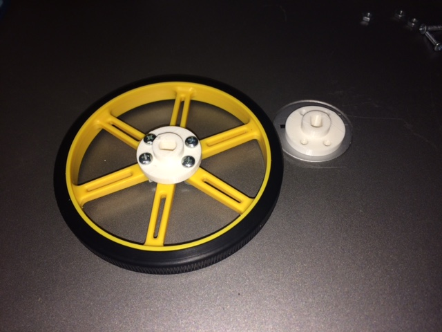
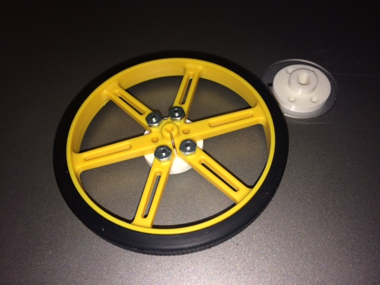

This is a FreeCAD drawing and generated STL file
for a hub adapter that allows one to attach a
Solarbotics GM8 143:1 gear motor (from Pololu,
see https://www.pololu.com/product/187 )
to a 90x10mm wheel from Pololu
(see https://www.pololu.com/product/1437 )

The latter has a small slotted hub, but it also
has six screw-holes for attachment to a hub adapter.

The adapter connects to the wheel with four 4-40
1/2 inch screws.

This is the view of the wheel and adaptor from the motor side. 

And this is the view of the wheel and adaptor from the
"street side."

